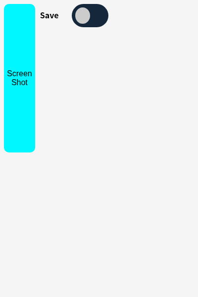

# Screenshotter for Chrome

A simple Chrome extension for taking screenshots.

## Features

- Capture visible tab / full page screenshots
- Copy to clipboard or download

## Installation

1. Clone this repository
2. Open `chrome://extensions` in Chrome
3. Enable **Developer mode**
4. Click **Load unpacked** and select the repository folder

### Verified install checklist

Verified against `manifest.json` (Manifest V3, version 1.1):

| Step | Expected outcome |
| ---- | ---------------- |
| Open `chrome://extensions`, enable Developer mode | Toggle switches on, "Load unpacked" button appears |
| Click Load unpacked, select this folder | "Screenshotter for Chrome" appears in the list with no errors |
| Pin the extension, click its toolbar icon | Popup opens showing a "Screen Shot" button and a "Save" toggle (see screenshot below) |
| Click Screen Shot (Save off) | Visible tab captured to clipboard |
| Turn Save on, click Screen Shot | PNG file downloaded (e.g. `YYYY-MM-DD_HH-MM-SS.png`) |

## Usage screenshots

Popup UI rendered from `popup.html` (400px width, headless Chrome):

- **Screen Shot button** (cyan): captures the visible tab via `chrome.tabs.captureVisibleTab`, copies the PNG to the clipboard.
- **Save toggle**: when on, also saves the capture with `chrome.downloads.download`.

## Permissions

- `activeTab` (capture the visible tab), `clipboardWrite` (copy to clipboard), `downloads` (optional save-to-file)

## License

MIT
